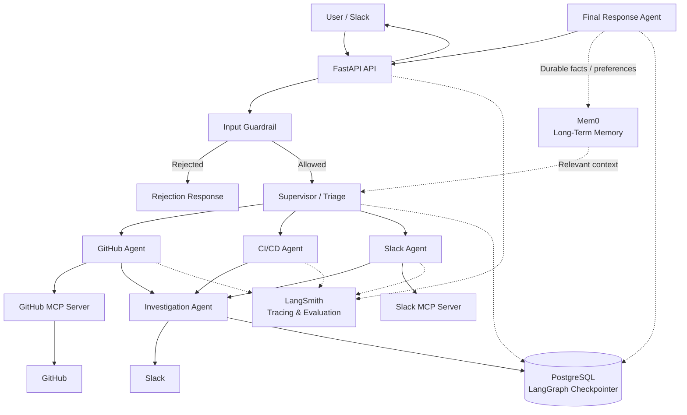

```mermaid

flowchart TD
    User["User / Slack"]
    Final["Final Response Agent"]
    API["FastAPI API"]
    Guard["Input Guardrail"]
    Reject["Rejection Response"]
    Mem["Mem0<br/>Long-Term Memory"]
    Super["Supervisor / Triage"]
    GH["GitHub Agent"]
    CICD["CI/CD Agent"]
    SlackA["Slack Agent"]
    GHMCP["GitHub MCP Server"]
    Invest["Investigation Agent"]
    SlackMCP["Slack MCP Server"]
    Lang["LangSmith<br/>Tracing & Evaluation"]
    GitHub["GitHub"]
    Slack["Slack"]
    PG[("PostgreSQL<br/>LangGraph Checkpointer")]

    User --> API
    API --> User
    Final --> API
    API --> Guard
    Guard -->|Rejected| Reject
    Guard -->|Allowed| Super
    Final -.->|Durable facts / preferences| Mem
    Mem -.->|Relevant context| Super
    Super --> GH
    Super --> CICD
    Super --> SlackA
    GH --> GHMCP
    GH --> Invest
    CICD --> Invest
    SlackA --> Invest
    SlackA --> SlackMCP
    GHMCP --> GitHub
    Invest --> Slack
    Invest --> PG
    GH -.-> Lang
    CICD -.-> Lang
    SlackA -.-> Lang
    API -.-> Lang
    Super -.-> PG
    Final -.-> PG
```


Running Tests:
```python
pytest tests/agents/ -s -v
```


